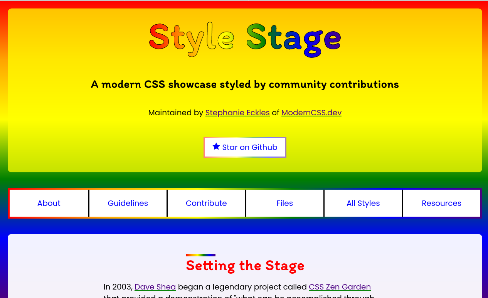

# Rainbow Style
> Style Stage contribution

## Table of contents
* [General info](#general-info)
* [Screenshots](#screenshots)
* [Technologies](#technologies)
* [Learnings](#learnings)
* [Setup](#setup)
* [Status](#status)
* [Contact](#contact)

## General info
Having learnt about Style Stage I thought it would be fun to come up with a style myself. The challenge was to only use CSS, you couldn't update the HTML at all. As long as it met the guidelines it didn't matter how it looked. And Style Stage did the auto-prefixing. I chose a Rainbow theme.

## Screenshots

## Technologies
* CSS

## Learnings
* Accessibility
* Gradients
* CSS selectors

## Setup
To view this style visit [Style Stage](https://stylestage.dev/styles/rainbow/)

## Status
Project is: _finished_

## Contact
Created by [nicm42](https://www.twitter.com/nicm4242) - feel free to contact me!
